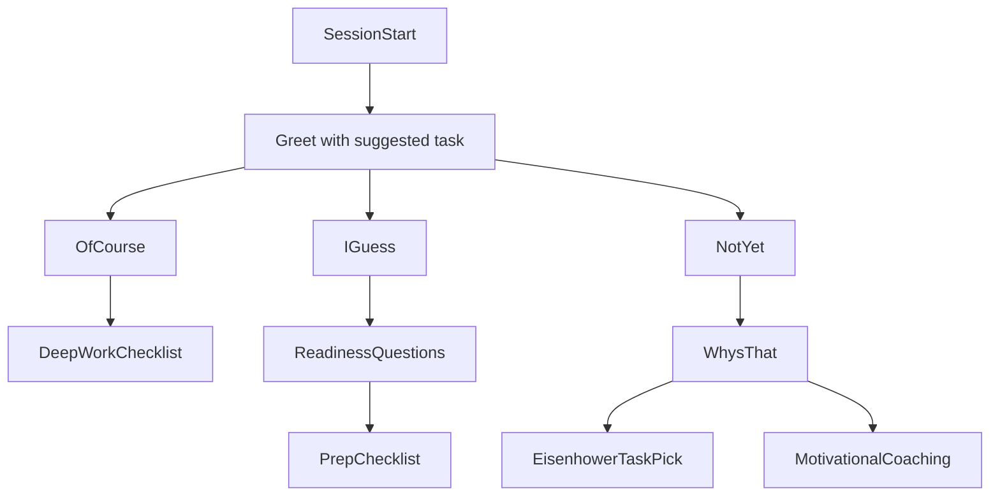
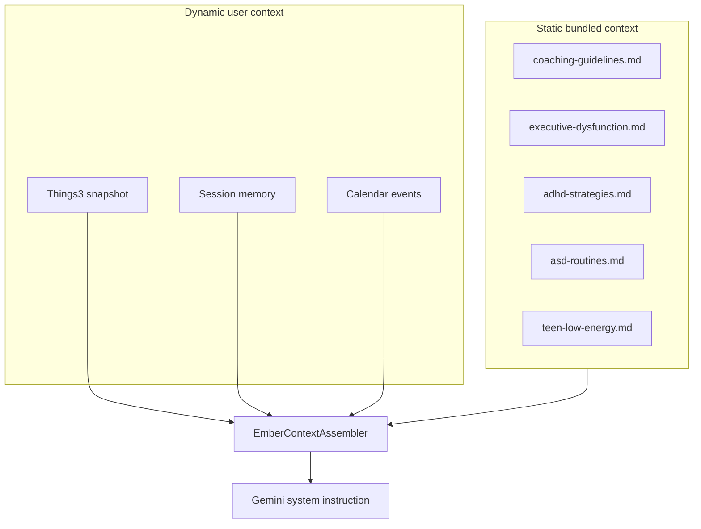
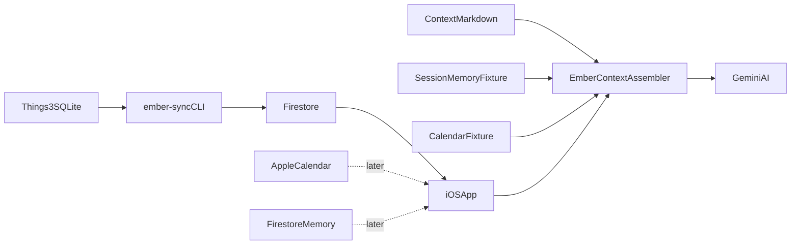

# Ember — Agent overview

Ember is a **proactive productivity coach** that helps users — especially teens navigating executive dysfunction, ADHD, ASD, and low mood — transition from procrastination into focused work. It is not a generic task list or open-ended chatbot.

See [readme.md](readme.md) for setup, build, and Firebase status.

---

## Product vision

### Session start

The app greets the user with a suggested task from their Things 3 context:

> "Hey there {name}, ready to work on {suggested task}?"

### Three readiness paths

| Response | Flow |
|----------|------|
| **Of course** | Deep-work prep checklist → first concrete step |
| **I guess** | Brief yes/no readiness questions → environment prep checklist (buttons when tired) |
| **Not yet** | "Why's that?" → Eisenhower task pick *or* motivational coaching |

### Long-term memory

A **Progress File** records patterns after each session (slippage per project, what prep helps, time-of-day effects). The AI reads the last 1–2 months at session start.

### Design target

"Claude Web" vibe — clean chat UI, status bar (last updated, theme, text size, date).



---

## AI context architecture

Gemini receives a **layered system instruction** assembled from five inputs. Today only the Things layer is wired in [`ChatViewModel`](Ember/ChatViewModel.swift); the rest is documented and seeded for the next implementation step.



### Layer 1 — Coaching guidelines

**File:** [`Shared/Context/coaching-guidelines.md`](Shared/Context/coaching-guidelines.md)

How Ember behaves: neurodiversity-affirming tone, low-energy mode (buttons over typing), smallest viable step, Eisenhower redirect, no invented tasks, session close notes.

### Layer 2 — Knowledge modules

**Directory:** [`Shared/Context/knowledge/`](Shared/Context/knowledge/)

| File | Topic |
|------|-------|
| `executive-dysfunction.md` | Task initiation, time blindness, working memory |
| `adhd-strategies.md` | Timers, body doubling, environment design |
| `asd-routines.md` | Predictability, sensory prep, transitions |
| `psychology-basics.md` | Avoidance cycles, behavioral activation |
| `teen-low-energy.md` | Micro-commitments, school triage when tired/depressed |

Curated summaries for coaching — **not medical advice**. Edit content in markdown, not inline in Swift. Loaded via [`KnowledgeModule`](Shared/KnowledgeModule.swift).

### Layer 3 — Things 3 snapshot (built)

Mac CLI [`ember-sync`](EmberSync/main.swift) reads Things SQLite → Firestore → iOS app. Formatted by [`ThingsContextFormatter`](Shared/ThingsContextFormatter.swift).

### Layer 4 — Session memory (fixture → Firestore)

**Now:** [`SessionMemoryFixture`](Shared/SessionMemoryFixture.swift) — hardcoded past discussions and slippage patterns.

**Later:** Firestore `users/{uid}/memory/current`, written after each session.

### Layer 5 — Calendar (fixture → EventKit)

**Now:** [`CalendarFixture`](Shared/CalendarFixture.swift) — sample schedule for development.

**Later:** EventKit read for today's events and open work windows.

### Assembly (planned)

`EmberContextAssembler` (not yet implemented) will concatenate layers in fixed order:

```
You are Ember, a personal work coach...

# How to coach
{coaching-guidelines}

# Background knowledge
{knowledge modules}

# This user's history
{session memory}

# Today's schedule
{calendar}

# Current work
{things markdown}
```

`ChatViewModel` should fingerprint the **full** assembled string, not just Things markdown.

---

## Data flow



| Concept | Role | Status |
|---------|------|--------|
| Things 3 + backlog | Task/project context | **Built** |
| Coaching guidelines | Interaction rules | **Seeded** — markdown in repo |
| Knowledge modules | ADHD, exec dysfunction, ASD, psychology | **Seeded** — markdown in repo |
| Session memory / Progress File | Behavioral memory | **Fixture** → Firestore later |
| Apple Calendar | Schedule awareness | **Fixture** → EventKit later |
| Watchdog | Sync on Things DB change | **Partial** — launchd WatchPaths |
| Coaching UI flows | Greeting, buttons, Eisenhower | **Not built** — generic chat only |

---

## Codebase map

| Path | Purpose |
|------|---------|
| [`Ember/`](Ember/) | iOS app — auth, chat, context loading |
| [`EmberSync/`](EmberSync/) | macOS CLI — Things → Firestore |
| [`Shared/`](Shared/) | Models, formatters, context fixtures, knowledge loader |
| [`Shared/Context/`](Shared/Context/) | Coaching guidelines + knowledge markdown (bundled resources) |
| [`scripts/`](scripts/) | Firebase deploy, WatchPaths install |
| [`launchd/`](launchd/) | Things sync agent plist |
| [`firestore.rules`](firestore.rules) | Per-user data isolation |

**Key files**

- [`ChatViewModel.swift`](Ember/ChatViewModel.swift) — Gemini chat (Things context only today)
- [`ThingsContextStore.swift`](Ember/ThingsContextStore.swift) — Firestore fetch + seed fixture
- [`ThingsDatabase.swift`](EmberSync/ThingsDatabase.swift) — Things 3 SQLite reader
- [`KnowledgeModule.swift`](Shared/KnowledgeModule.swift) — loads bundled markdown

---

## Implementation backlog

1. **`EmberContextAssembler`** — wire all five layers into `ChatViewModel`
2. **Proactive session UI** — greeting + Of course / I guess / Not yet buttons
3. **Coaching flow state machine** — structured branches from wireframe
4. **Firestore session memory** — replace `SessionMemoryFixture`
5. **Task suggestion logic** — pick suggested task from Things (deadlines, Eisenhower)
6. **EventKit calendar** — replace `CalendarFixture`
7. **Low-friction mode** — button-only UI when energy is low
8. **Design polish** — Claude Web aesthetic, status bar

---

## Agent guidelines

- Match existing Swift patterns: `@Observable`, `@MainActor`, shared code in `Shared/`.
- Edit coaching content in [`Shared/Context/`](Shared/Context/) markdown — not inline in Swift.
- Keep `ember-sync` and iOS in sync via `Shared/`; do not duplicate models.
- Extend `ChatViewModel` / flow state types for coaching UI; avoid unrelated one-off views.
- New persistent user data → Firestore under `users/{uid}/` with rules in [`firestore.rules`](firestore.rules).
- [`readme.md`](readme.md) = setup runbook; **this file** = product + architecture reference.
